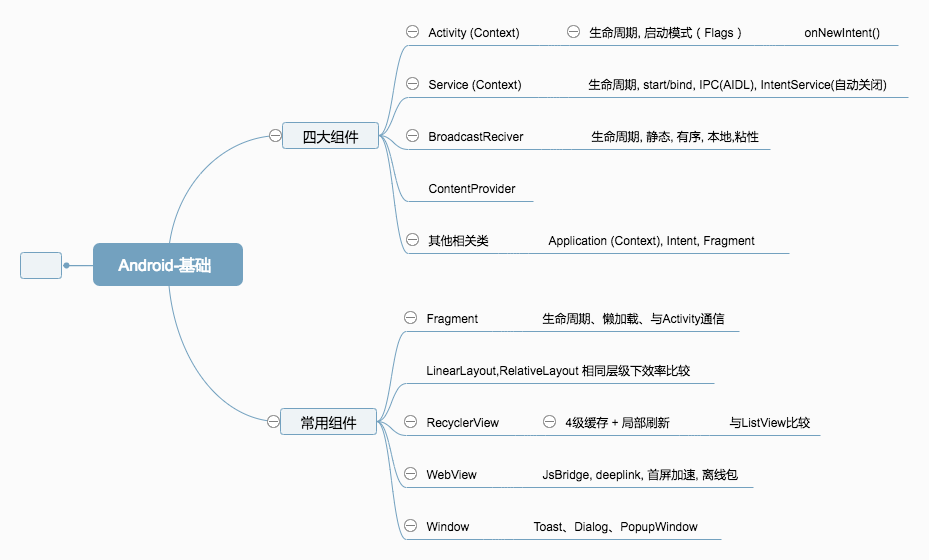
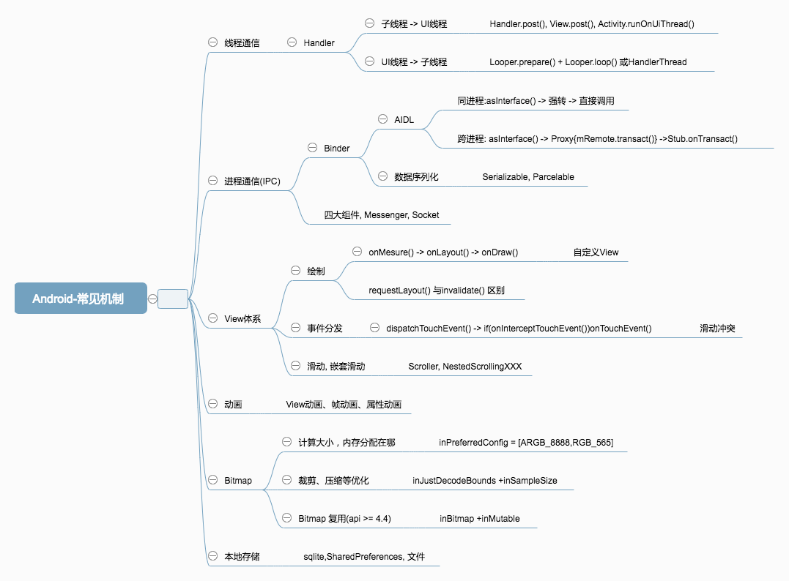
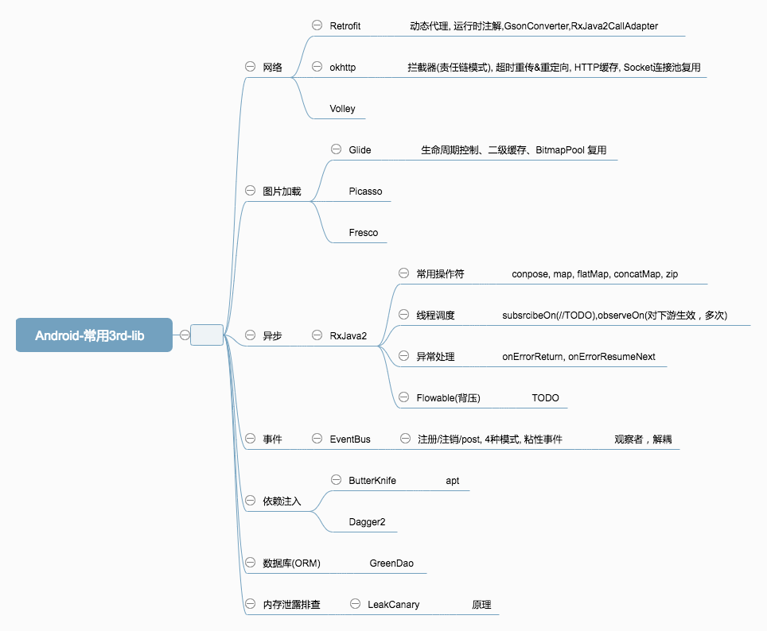
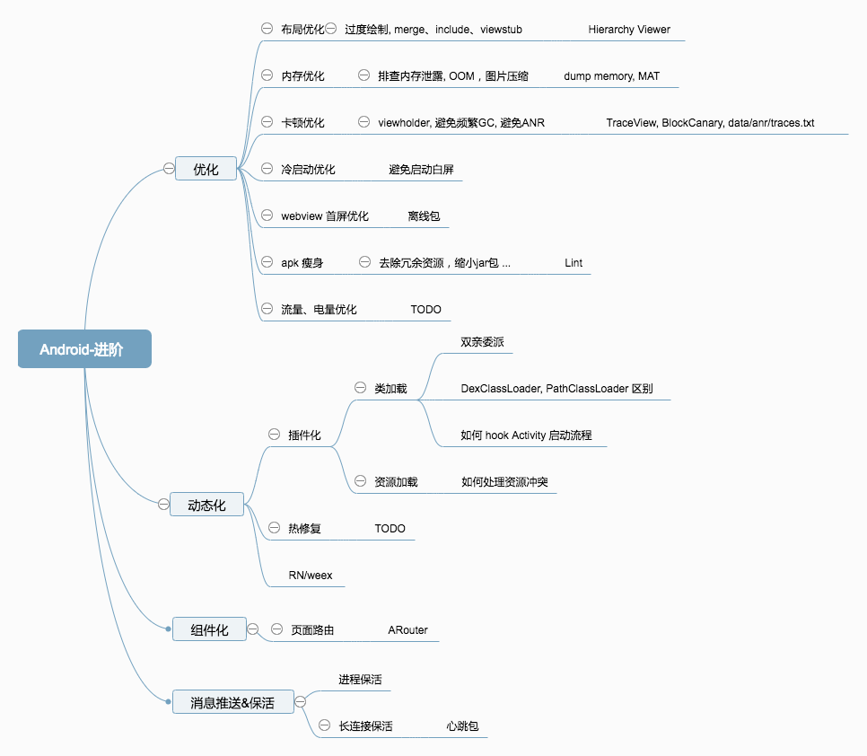

# 1. 前言
>前后历时一个半月，也算是拿到了心仪的 offer，顺便水一篇总结把。

前后经历了菜鸟网络、有赞、手淘、头条、全民直播、喜马拉雅，面的多是 1~3 年的岗位。除了手淘和头条一面被刷 QAQ，其他的都走完了流程，然而拿到 offer 的只有最后两个。对比之下，选择了喜马拉雅。

马云说，员工离职的原因无非是钱不到位、或者心委屈了。看着周围的同事整天浑浑噩噩，满足于改改UI、应付一下需求，不知不觉就过30岁了，这可不是我想要的生活。「生于忧患，死于安乐」，温水煮青蛙永远不是什么好事。

毕业时，年少无知，加上当时水平太菜，稀里糊涂进了小公司。现在看来凭空给面试增加了不少难度 QAQ。整体下来最常听到的一句话是「你的 app 没啥亮点嘛」233，印象分大减。所以项目简单的话，基础千万要打扎实。

其实，挺想进阿里的，尽管没有如愿，不过也是一次宝贵的经历。孙子兵法有云：「求其上，得其中；求其中，得其下；求其下，必败。」好在一开始照着 bat 的目标去准备，最后去了喜马拉雅，到也还好。还有一点，阿里各部门的难度也是不同的。手淘就明显难于菜鸟，毕竟这么多年的积累在那里。

技术栈最新的应该是有赞，那边的氛围非常不错。这几个问题你们感受下：

- http2 相对 http1 有哪些优化
- 平常怎么学习 http, RFC 看过吗
- 协程了解过吗
- 前几天刚出的「快应用」了解过吗（我去面的时候真的是刚出来没几天 QAQ）
- 熟悉 Rxjava？解释一下背压，解释一下 Observable 冷、热
- 。。。

虽然走完流程了，不过很多没答上来，最后凉凉了。

头条、手淘的话，都遇到了「图片框架选型」，没有刻意准备的话这个问题多半要栽。常见的 Picasso, Fresco, Glide, 需要你对比着讲一下，其他的公司可能能讲清楚你熟悉的那个就放过你了。手淘还特意问到了 Glide 中的 BitmapPool，也即 Bitmap 重用的实现（注意与 Bitmap 缓存（LRUCache）不是同一个东西），一脸懵逼.jpg 。。。

另外，okhttp 也可能被问到，只知道个拦截器是不行的。

总体而言，像 java 基础、并发、JVM、计算机网络那点东西，还有 android 四大组件、handler、事件分发、绘制、动画，这些都能背下来的，绝对不能丢分。像插件化、热修复之类的高级主题，还有 okhttp 这种较为复杂的第三方库，短时间内啃不下来，也就听天由命吧，至少拿到了基础分。

>路漫漫其修远兮，吾将上下而求索。

# 2. Android 篇
## 2.0 Java 基础
>下面放一下我整理的 Android 知识脑图，顺便联动一下之前的 Java 篇 [Android 知识体系脑图「java篇」](https://fashare2015.github.io/2018/03/26/android-skill-tree[java]/)
>
>还有一个个人认为非常棒的「java + 计算机网络」的总结，分享给大家：
>
>[https://github.com/CyC2018/Interview-Notebook/](https://github.com/CyC2018/Interview-Notebook/)

>缩略图有点模糊，建议PC上看大图，或保存到本地来看。

## 2.1 Android 基础
> 推荐资料：官方文档

## 2.2 Android 常见机制

> 推荐资料：《Android开发艺术探索》+ 源码

## 2.3 Android 常用3rd-lib

> 推荐资料：github 项目源码

## 2.4 Android 进阶

> 推荐资料：美团点评技术博客，bugly博客。。。杂七杂八的博客

# 3. 面试资料推荐
[Android校招面试指南](https://lrh1993.gitbooks.io/android_interview_guide/content/)

[guoxiaoxing/android-interview](https://github.com/guoxiaoxing/android-interview)

[技术面试基础知识](https://github.com/CyC2018/Interview-Notebook/)

[francistao/LearningNotes](https://github.com/francistao/LearningNotes)

[国内一线互联网公司内部面试题库](http://www.jackywang.tech/AndroidInterview-Q-A/chinese/)

[wanandroid/面试资料汇总](http://www.wanandroid.com/article/list/0?cid=73)

