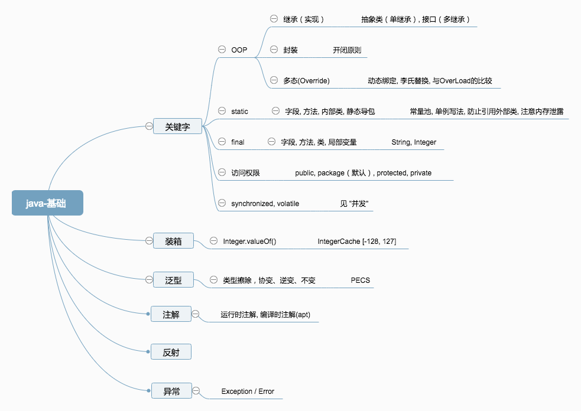
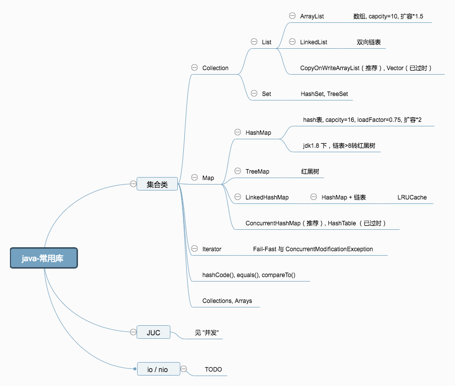
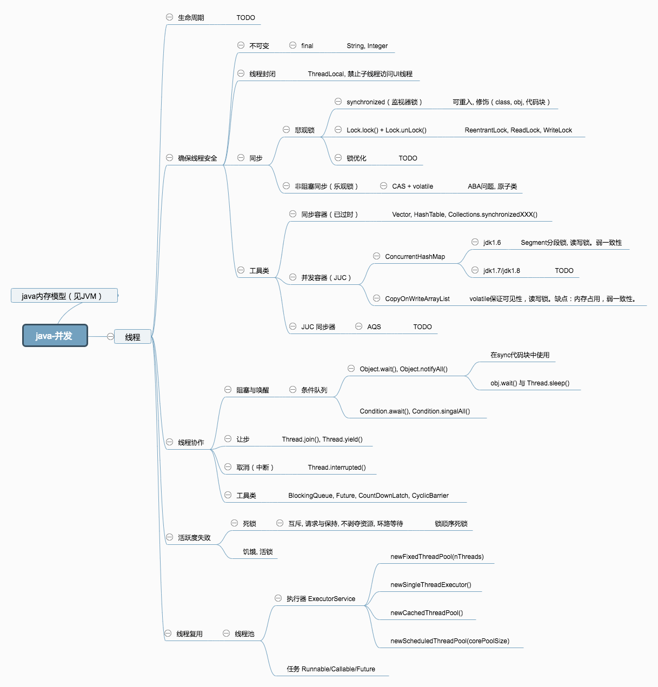
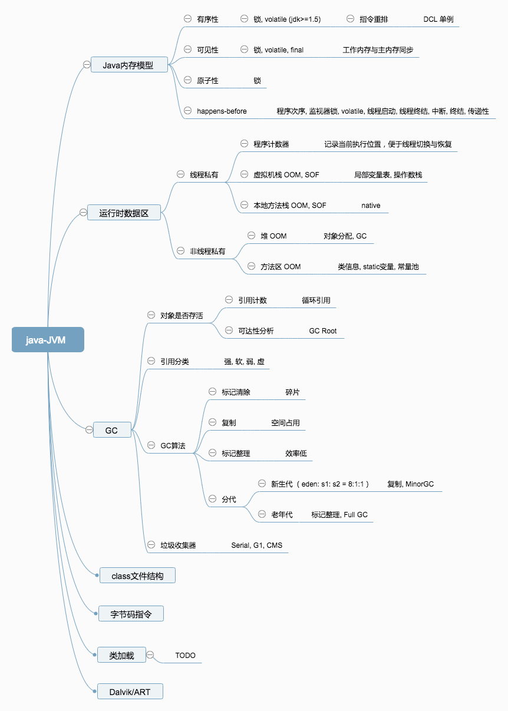

# 1. 前言
>最近准备跳槽一波，试了一下水，现在要求越来越高，基础不行根本活不过两集，连boss的面都见不到。

边面试边总结，回来恶补基础，花了些时间整理了下知识体系。自己看书也怕理解有误，希望大佬留言交流指正与补充。

这篇文章主要还是脑图的形式，不会展开细节，当做是**划重点**把。

像 HashMap, ArrayList, 线程池, 都有问到把。搞个脑图方便快速查漏补缺（不禁回忆起高三的美好时光QAQ）。

>缩略图有点模糊，建议PC上看大图，或保存到本地来看。

# 2. Java 篇
## 2.1 Java 基础
> 推荐书籍: 《Thinking in Java》+《Effective java》

## 2.2 JDK 常用库
> 推荐书籍: 《Thinking in Java》+ JDK 源码

## 2.3 Java 并发
> 推荐书籍: 《Java并发编程实践》+《深入理解java虚拟机》

## 2.4 JVM
> 推荐书籍: 《深入理解java虚拟机》

# 3. 小结
java 篇大概就这些，后续会有 Android 篇。

> 有好的书籍、资料推荐欢迎留言。

