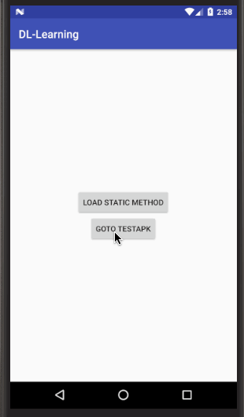
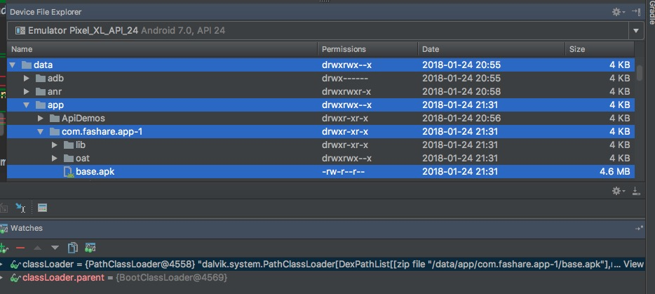

# 1 前言
插件化算是比较复杂的一个话题。刚一接触的时候，我是一脸懵逼的，网上看了很多博客，一直是似懂非懂，不得其要领。期间也尝试看了`Small`，也是知其然不知其所以然。

就此搁置一段时间，直到真正拿出勇气，尝试自己实现插件化，成功加载了四大组件之一`Activity`。这才明白它的背后究竟做了什么，以及为什么这么做。

希望借着这篇文章，谈谈自己的理解。也希望通过我的小 Demo，能帮大家更轻松的理解诸如`Small`、`VirtualApk`、`Atlas`之类的大型框架。如有纰漏，请留言指出。

# 2 效果预览
`主apk[com.fashare.app.MainActivity]`唤起`sd卡`上的`插件apk[com.fashare.testapk.PluginActivity]` :



# 3 源码
[https://github.com/fashare2015/Dynamic-Load-Learning](https://github.com/fashare2015/Dynamic-Load-Learning)


# 4 原理与实现
>Activity 的加载，可以分为「类加载」和「资源加载」两个主题。

>考虑到篇幅比较长，本文主要讨论「类加载」。

>「资源加载」将放到下一篇文章中探讨。

## 4.1 类加载
根据 Java 的类加载机制，我们知道，JVM 通过`ClassLoader`来加载 jar 包中的 .class 文件。并且我们需要注意两点：

 - 一个 .class 文件 + 一个 ClassLoader 唯一确定一个 java 类 
 - 请遵循 [双亲委派模型](http://kaedea.com/2016/02/07/android-dynamical-loading-02-classloader/)

「双亲委派模型」通俗的讲就是，系统类诸如`java.*`全都委派给 JVM 默认的 `Bootstrap ClassLoader` 加载，其他的由用户自定义的 ClassLoader 加载。这样可以保护`java.*`下的类，并确保系统类的唯一性。否则，会出现 `yourClassLoader.loadClass("java.lang.String") != String.class`

于是，Android 提供了两类自定义的 ClassLoader 来加载 dex 中的 .class 文件。

- PathClassLoader 只能加载已安装(data/app/目录下)的apk
- DexClassLoader 可以加载外部(sd卡上)的apk

如下图，打开我们的 demo 可以看到，它被安装到`data/app/`下。然后由`PathClassLoader`来加载其中的所有类。



>AS 3.0 可以预览手机上的文件，非常方便。

### 4.1.1 创建插件专用的 DexClassLoader
由于要加载外部的插件 apk，你大概猜到了，我们得用 new 一个`DexClassLoader`来加载插件 apk 中的类。

```java
package dalvik.system;

/**
 * A class loader that loads classes from {@code .jar} and {@code .apk} files
 * containing a {@code classes.dex} entry. This can be used to execute code not
 * installed as part of an application.
 */
public class DexClassLoader extends BaseDexClassLoader {
    /**
     * Creates a {@code DexClassLoader} that finds interpreted and native
     * code.  Interpreted classes are found in a set of DEX files contained
     * in Jar or APK files.
     *
     * @param dexPath the list of jar/apk files containing classes and
     *     resources, delimited by {@code File.pathSeparator}, which
     *     defaults to {@code ":"} on Android
     * @param optimizedDirectory directory where optimized dex files
     *     should be written; must not be {@code null}
     * @param librarySearchPath the list of directories containing native
     *     libraries, delimited by {@code File.pathSeparator}; may be
     *     {@code null}
     * @param parent the parent class loader
     */
    public DexClassLoader(String dexPath, String optimizedDirectory,
            String librarySearchPath, ClassLoader parent) {
        super(dexPath, new File(optimizedDirectory), librarySearchPath, parent);
    }
}
```
看一眼它的注释，大意是说「它可以加载 .jar/.apk 中未安装的代码作为 app 的一部分」。其中四个参数分别为：
 
 - dexPath：插件 apk 的路径
 - optimizedDirectory: 需指定一个缓存目录
 - librarySearchPath: native lib，暂时不太需要，直接给 null
 - parent: 根据「双亲委派模型」，应该给它宿主 apk 默认的`PathClassLoader`。


于是，我们这样先 new 一个 dexClassLoader 备用：

```java
package com.fashare.dl

/**
 * 动态加载（门面类）
 */
object DL {
    lateinit var dexClassLoader: DexClassLoader
    
    /**
     * 加载 sdcard 上的 未安装的 apk
     */
    fun loadApk(context: Context, pluginUri: Uri) {
        dexClassLoader = DexClassLoader(
                pluginUri.path,
                context.cacheDir.path,
                null,
                context.classLoader)
    }
   
    ...
}
```

然后在主 app 的 Application 里调用一下：

```java
package com.fashare.app

class App: Application(){
    override fun onCreate() {
        super.onCreate()

        val pluginFile = File(Environment.getExternalStorageDirectory(), "testapk-with-res.apk")
        copyTestApkToSdcard(pluginFile)
        DL.loadApk(this, Uri.fromFile(pluginFile))
    }
}
```

### 4.1.2 用 dexClassLoader 加载插件中的 Activity
>已经有了 dexClassLoader，我们需要在`合适的时机`加载插件里的 Activity。

研究一发 Activity 启动流程，我们会发现 Activity 从创建到销毁都会经过`Instrumentation`这个类。它非常重要，后面会经常和它打交道。

我们平常在 Manifest 里注册的 Activity 类名，最终会走到`Instrumentation.newActivity`，然后反射出 Activity 实例。

所以，我们只需 hack 掉这个方法，new 出我们想要的 Activity 即可。

```java
package android.app;

public class Instrumentation { 
    ...
	public Activity newActivity(ClassLoader cl, String className, Intent intent)
            throws InstantiationException, IllegalAccessException, ClassNotFoundException {
        return (Activity)cl.loadClass(className).newInstance();
    }
}
```

### 4.1.3 hack Instrumentation
我们一起来找这个 hack 点。

我们知道，`ActivityThread`，也就是我们常说的主线程，它是进程级别的单例。

我们发现，它刚好有一个 Instrumentation 的成员变量，且参与到`startActivity`等各种重要的流程中，把它换掉就行啦。

```java
package android.app;

public final class ActivityThread {
    // 单例
    private static volatile ActivityThread sCurrentActivityThread;
    public static ActivityThread currentActivityThread() {
        return sCurrentActivityThread;
    }
    
    Instrumentation mInstrumentation;
    
    public static void main(String[] args) {
        ...
        // 我们常说的 Looper 的初始化
        Looper.prepareMainLooper();

        ActivityThread thread = new ActivityThread();
        // 在 attach() 里，new 出了 Instrumentation，也是进程级别唯一的
        thread.attach(false);
        
        ...
        Looper.loop();
    }
    
    private void attach(boolean system) {
        sCurrentActivityThread = this;
        
        if (!system) {
            ...
        } else {
            ...
            mInstrumentation = new Instrumentation();
        }
        ...
    }
}
```
于是，我们用反射搞一下，换成我们自定义的`InstrumentationProxy`。用它来`代理`原来的 Instrumentation：

```java
package com.fashare.dl

object DL {
    lateinit var dexClassLoader: DexClassLoader
    internal lateinit var instrumentation: Instrumentation

    fun loadApk(context: Context, uri: Uri) {...}

    /**
     * 替换 ActivityThread.mInstrumentation
     */
    fun replaceInstrumentation() {
        // 反射伪代码：
        val base = ActivityThread.currentActivityThread().mInstrumentation
        
        ActivityThread.currentActivityThread().mInstrumentation = InstrumentationProxy(base)
    }
}
```

InstrumentationProxy 其他不动，仅仅 override (hack) 掉 newActivity 这个方法。

```java
package com.fashare.dl

/**
 * Instrumentation 代理类
 */
internal class InstrumentationProxy(val base: Instrumentation) : Instrumentation() {

    override fun newActivity(cl: ClassLoader?, className: String?, intent: Intent?): Activity? {
        // 不用默认的 cl，而是用事先准备好的 DL.dexClassLoader 来加载 Activity。
        return base.newActivity(DL.dexClassLoader, className, intent)
    }
}
```

哈哈，到此为止，我们的 Activity 类加载已经完成啦。

注意此时的插件 Activity 只能是空 Activity，不能访问 R 资源（此时还没实现），但可以打 Log 以及 Toast。在主 app 里试用一下：

1. 在 App.onCreate() 里调用 `DL.replaceInstrumentation()` —— 做 hack 
2. 在 App.onCreate() 里调用 `DL.loadApk(this, Uri.fromFile(pluginFile))` —— 指定插件 apk 路径
3. 在主 app 的 Manifest 里注册 `com.fashare.testapk.PluginActivity`
4. 在主 app 的 MainActivity 里调用 
   `startActivity(Intent(this, DL.dexClassLoader.loadClass("com.fashare.testapk.PluginActivity")))`。
 
应该可以看到，已经成功唤起插件 Activity 了，生命周期也照常被调用。

### 4.1.4 还没有结束
且看前面的第 3 步，如果使用插件还得把所有插件里的 Activity 事先在宿主 apk 里注册一遍，那一点也不动态啊。所以，我们看到的市面上的插件化框架都是不需要注册 Activity 的，我们也想办法优化掉这一步。

直接上结论吧，startActivity() 走到 AMS 的时候，它会检查目标 Activity 是否注册过，并拦截掉未注册的 Activity。说实话，这一段还没有仔细的去跟过。

于是呢，我们可以事先注册一个空 Activity，把 Intent 的目标 Activity 换成它，用它骗过 AMS 的检查。然后在 newActivity 的时候，new 我们真正需要的插件 Activity。(有点 ViewStub 的感觉？)

代码实现主要是 hack 掉 `Instrumentation.execStartActivity`

```java
package com.fashare.dl

/**
 * Intent 代理类，替换 component.className 为 StubActivity
 */
internal class IntentProxy(var base: Intent?) : Intent() {
    init {
        component = ComponentName(base?.component?.packageName, StubActivity::class.java.name)
    }
}

/**
 * 占坑用 Activity
 */
internal class StubActivity : AppCompatActivity()

internal class InstrumentationProxy(val base: Instrumentation) : Instrumentation() {
    var mIntentProxy: IntentProxy? = null

    /**
     * new 之前，取出原始的 intent 来 new Activity实例
     */
    override fun newActivity(cl: ClassLoader?, className: String?, intent: Intent?): Activity? {
        return (mIntentProxy?.base ?: intent)?.let {
            mIntentProxy = null
            base.newActivity(DL.dexClassLoader, it.component?.className, it)
        }
    }

    /**
     * start 之前，替换 Intent 为 已注册的 StubActivity, 以绕过 系统对 manifest 的检查
     *
     * 注: 这里其实也是 override, 只是 super.execStartActivity(...) 为 @hide, 所以看起来比较奇怪.
     */
    fun execStartActivity(
            who: Context?, contextThread: IBinder?, token: IBinder?, target: Activity?,
            intent: Intent?, requestCode: Int, options: Bundle?): ActivityResult? {
            
        mIntentProxy = IntentProxy(intent)

        return try {
            Reflect.on(base).call("execStartActivity",
                    who, contextThread, token, target,
                    mIntentProxy, requestCode, options).get<ActivityResult?>()
        } catch (e: Exception) {
            null
        }
    }
}
```
### 4.1.5 类加载小结
类加载告一段落，弄透重要的几点，再去看那些成熟的框架，会轻松很多：

 - DexClassLoader
 - hack Instrumentation
 - Actiivty(四大组件)占坑

## 4.2 资源加载（预告）
现在还只能是空 Activity，如果试图访问 R 资源，就算是简单的一句 setContextView(R.layout.activity_plugin)，程序立马就 crash 了。
(当然，demo 里已经支持资源的加载了。)

>R.layout.activity_plugin 为啥找不到呢？

>我们又该如何加载插件资源？

>插件资源与宿主资源冲突又该怎么办呢？

>且听下回分解~

# 5 感谢
[《Android插件化技术——原理篇》—— 腾讯Bugly](https://mp.weixin.qq.com/s?__biz=MzA3NTYzODYzMg==&mid=2653579547&idx=1&sn=9f782f6c91c20fd0b17a6c3762b6e06a&chksm=84b3bb1cb3c4320ad660e3a4a274aa2e433bf0401389f38be337d01d2ba604714303e169d48a&mpshare=1&scene=23&srcid=0111lAPa4UGPssFMoc05pgLP#rd)

[Android 插件化原理解析——插件加载机制 —— weishu](http://weishu.me/2016/04/05/understand-plugin-framework-classloader/)

[8个类搞定插件化——Activity —— 开源实验室](https://kymjs.com/code/2016/05/15/01/)

[插件化框架 Small](https://github.com/wequick/Small)

[插件化框架 VirtualAPK —— 滴滴](https://github.com/didi/VirtualAPK)
