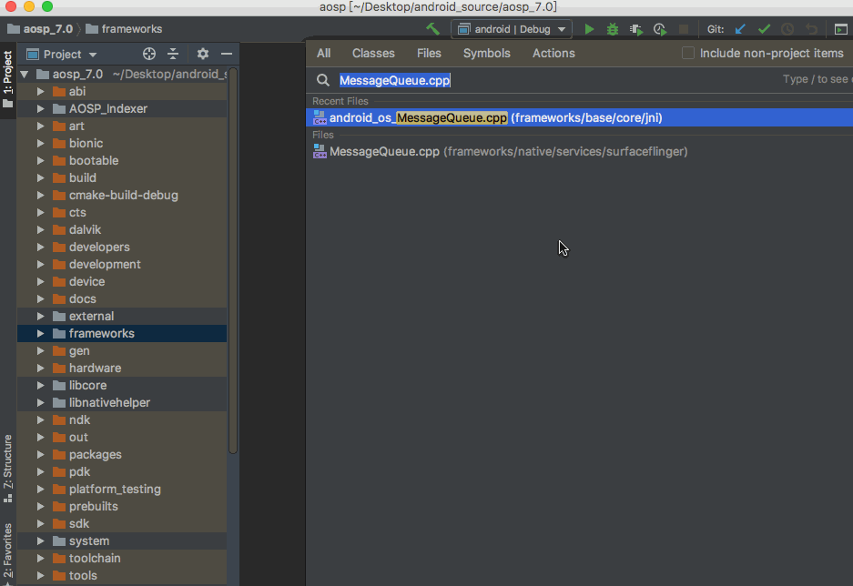

# 1. 前言
先上个效果图，从 `MessageQueue.nativePollOnce` 一直跟到 `Looper.cpp` 中的 `epoll_wait`，非常的丝滑。



# 2. 一些尝试
>猜猜看是什么IDE？

记得AS导入aosp的java代码是很方便的，有个idegen帮你搞定。

但是AS对c++的支持稍微有些微妙。NDK支持做的很棒，但也仅限于NDK。

尝试过用 NDK 的方式来建索引，差点卡出翔来。

最后找到了这款兄弟软件——`Clion`。(是不是界面和AS一模一样？)

# 3. C++建立索引的姿势
## 3.1 makefile与cmake
我们知道，整个aosp是由makefile来构建的。（历史遗留原因）

makefile之于c++，正如maven之于java。

不过makefile语法较为繁琐，现在的项目多以更简洁的cmake构建。（NDK也是基于cmake, makefile应该是比较古老了）

那么类比过来，cmake取代makefile，正如gradle取代maven。(一个比喻，不一定恰当)

## 3.2 编写 CMakeLists.txt
>AS除了NDK之外，貌似不支持cmake。不过他的兄弟`Clion`能很好的支持。

首先，我们阅读c++代码，并不需要完全的编译它。

其次，编写 CMakeLists.txt 来引入少许关键模块，告诉IDE那些是需要引入的c++的源文件。

看起来像这样：(CMakeLists.txt)

```cmake
cmake_minimum_required(VERSION 3.5)
add_definitions(-DANDROID)

set(PROJECT_DIR "${CMAKE_HOME_DIRECTORY}")
project(android)

...

include_directories(frameworks/native/include)
include_directories(frameworks/base/include/)
...
```

## 3.3 用 .ipr 排除模块
`.ipr`和`.iml`是idea系列IDE的项目结构文件。用`idegen`导入过java代码的话，你可能会有些印象。

首次导入时，IDE会扫描所有文件。需要用`<excludeRoots>`标签排除一些暂时不看的模块，不然会卡爆。

大概看起来像这样：(aosp.ipr) 可按需自行修改

```xml
<project version="4">
  <component name="CMakeWorkspace" PROJECT_DIR="$PROJECT_DIR$" />
  <component name="CidrRootsConfiguration">
    <excludeRoots>
      <file path="$PROJECT_DIR$/.repo" />
      <file path="$PROJECT_DIR$/abi" />
      <file path="$PROJECT_DIR$/art" />
      <file path="$PROJECT_DIR$/bionic" />
      <file path="$PROJECT_DIR$/bootable" />
      <file path="$PROJECT_DIR$/build" />
      ...
    </excludeRoots>
  </component>
  ...
  <component name="ProjectModuleManager">
    <modules>
      <module fileurl="file://$PROJECT_DIR$/aosp.iml" filepath="$PROJECT_DIR$/aosp.iml" />
    </modules>
  </component>
```

# 4. 其他

**完整 CMakeLists.txt 和 .ipr 见 github：[AOSP_Indexer](https://github.com/fashare2015/AOSP_Indexer)。放入asop根目录，然后用Clion打开.ipr文件即可。**

如何调试aosp c++代码？没试过，记得`weishu`的博客里有一篇

大家都用的啥工具? Source Insight? 记事本？欢迎留言交流。
 