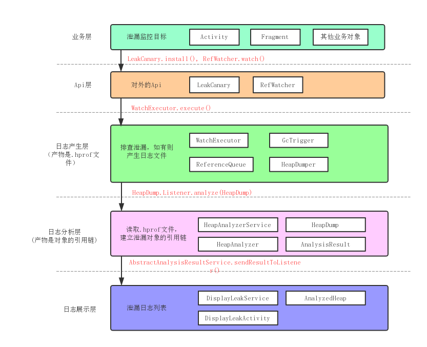

# 1. 前言
LeakCanary 是由 Square 开发的一款内存泄露检测工具。相比与用 IDE dump memory 的繁琐，它以轻便的日志被广大开发者所喜爱。让我们看看它是如何实现的吧。

>ps: Square 以著名框架 Okhttp 被广大开发者所熟知。

# 2. 源码分析
## 2.1 设计架构
分析一个框架，我们可以尝试先分层。好的框架层次清晰，像TCP/IP那样，一层一层的封装起来。这里，我按照主流程大致分了一下。

一图流，大家可以参考这个图，来跟源码。



## 2.2 业务层
按照教程，我们通常会有如下初始化代码:

 1. Applicaion 中：`mRefWatcher = LeakCanary.install(this);`
 2. 基类 Activity/Fragment onDestory() 中: `mRefWatcher.watch(this);`

虽然是用户端的代码，不过作为分析框架的入口，不妨称为业务层。 

>这一层我们考虑的是检测我们的业务对象 Activity。当然你也可以用来检测 Service。

## 2.3 Api层
从业务层切入，我们引出了两个类`LeakCanary`、`RefWatcher`，组成了我们的 api 层。

>这一层我们要考虑如何对外提供接口，并隐藏内部实现。通常会使用 `Builder`、`单例`、适当的`包私有权限`。

### 2.3.1 主线1 install()

```java
public final class LeakCanary {

  public static @NonNull RefWatcher install(@NonNull Application application) {
    return refWatcher(application)
        .listenerServiceClass(DisplayLeakService.class)
        .excludedRefs(AndroidExcludedRefs.createAppDefaults().build())
        .buildAndInstall();
  }
  
  public static @NonNull AndroidRefWatcherBuilder refWatcher(@NonNull Context context) {
    return new AndroidRefWatcherBuilder(context);
  }
}
```
我们先看`install()`，先拿到一个`RefWatcherBuilder`，转而使用`Builder`模式构造一个`RefWatcher`作为返回值。
大概可以知道是框架的一些初始配置。忽略其他，直接看`buildAndInstall()`。

```java
public final class AndroidRefWatcherBuilder extends RefWatcherBuilder<AndroidRefWatcherBuilder> {
  ...
  private boolean watchActivities = true;
  private boolean watchFragments = true;
  
  public @NonNull RefWatcher buildAndInstall() {
    RefWatcher refWatcher = build();
    if (refWatcher != DISABLED) {
      ...
      if (watchActivities) { // 1
        ActivityRefWatcher.install(context, refWatcher);
      }
      if (watchFragments) {  // 2
        FragmentRefWatcher.Helper.install(context, refWatcher);
      }
    }
    return refWatcher;
  }
}
```
可以看到 1, 2 两处，默认行为是，监控 Activity 和 Fragment。
以 Activity为例：

```java
public final class ActivityRefWatcher {

  public static void install(@NonNull Context context, @NonNull RefWatcher refWatcher) {
    ...
    application.registerActivityLifecycleCallbacks(activityRefWatcher.lifecycleCallbacks);
  }

  private final Application.ActivityLifecycleCallbacks lifecycleCallbacks =
      new ActivityLifecycleCallbacksAdapter() {
        @Override public void onActivityDestroyed(Activity activity) {
          refWatcher.watch(activity);
        }
      };
}
```
使用了`Application.ActivityLifecycleCallbacks`，看来我们基类里的`watch()`是多余的。Fragment 也是类似的，就不分析了，使用了`FragmentManager.FragmentLifecycleCallbacks`。


> PS: 老版本默认只监控 Activity，watchFragments 这个字段是 2018/6 新增的。

### 2.3.2 主线2 watch()
之前的分析，引出了`RefWatcher.watch()`，它可以检测任意对象是否正常销毁，不单单是 Activity。我们来分析看看：

```java
public final class RefWatcher {

  private final WatchExecutor watchExecutor;

  public void watch(Object watchedReference, String referenceName) {
    ...
    String key = UUID.randomUUID().toString();
    retainedKeys.add(key);
    final KeyedWeakReference reference = new KeyedWeakReference(watchedReference, key, referenceName, queue);

    ensureGoneAsync(watchStartNanoTime, reference);
  }
  
  private void ensureGoneAsync(final long watchStartNanoTime, final KeyedWeakReference reference) {
    watchExecutor.execute(new Retryable() {
      @Override public Retryable.Result run() {
        return ensureGone(reference, watchStartNanoTime);
      }
    });
  }
}
```
通过这个 watch()，我们可以注意到这几点：

1. 为了不阻塞我们的`onDestory()`，特意设计成异步调用——`WatchExecutor`。
2. 有一个弱引用 `KeyedWeakReference`，干嘛用的呢？

> 我们该怎么设计 WatchExecutor 呢？AsyncTask？线程池？我们接着往下看

## 2.4 日志产生层
现在我们来到了非常关键的一层，这一层主要是分析是否泄露，产物是`.hprof文件`。
我们平常用 IDE dump memory 的时候，生成的也是这种格式的文件。

### 2.4.1 WatchExecutor 异步任务
接之前的分析，`WatchExecutor`主要是用于异步任务，同时提供了失败重试的机制。

```java
public final class AndroidWatchExecutor implements WatchExecutor {
  private final Handler mainHandler;
  private final Handler backgroundHandler;

  public AndroidWatchExecutor(long initialDelayMillis) {
    mainHandler = new Handler(Looper.getMainLooper());
    HandlerThread handlerThread = new HandlerThread(LEAK_CANARY_THREAD_NAME);
    handlerThread.start();
    backgroundHandler = new Handler(handlerThread.getLooper());
    ...
  }

  @Override public void execute(@NonNull Retryable retryable) {
    if (Looper.getMainLooper().getThread() == Thread.currentThread()) {
      waitForIdle(retryable, 0);
    } else {
      postWaitForIdle(retryable, 0);
    }
  }
  ...
}
```
看来是使用了`HandlerThread`。没啥说的，要注意一下子线程`Handler`的使用方式。之后便会回调`ensureGone()`，注意此时执行环境已经切到子线程了。

### 2.4.2 ReferenceQueue 检测泄露
分析下一步之前，我们先介绍一下 `ReferenceQueue`。

1. 引用队列 ReferenceQueue 作为参数传入 WeakReference.
2. WeakReference 中的 value 变得不可达，被 JVM 回收之前，WeakReference 会被加到该队列中，等待回收。

说白了，ReferenceQueue 提供了一种通知机制，以便在 GC 发生前，我们能做一些处理。

> 详见 [Reference 、ReferenceQueue 详解](https://www.jianshu.com/p/f86d3a43eec5)


好了，让我们回到 RefWatcher。

```java
final class KeyedWeakReference extends WeakReference<Object> {
  public final String key;		// 由于真正的 value 正等待回收，我们追加一个 key 来识别目标。
  public final String name;

  KeyedWeakReference(Object referent, String key, String name,
      ReferenceQueue<Object> referenceQueue) {
    super(checkNotNull(referent, "referent"), checkNotNull(referenceQueue, "referenceQueue"));
    this.key = checkNotNull(key, "key");
    this.name = checkNotNull(name, "name");
  }
}

public final class RefWatcher {
  private final Set<String> retainedKeys;  // 保存未回收的引用的 key。 watch()时 add, 在 queue 中找到则 remove。
  private final ReferenceQueue<Object> queue; // 收集所有变得不可达的对象。

  public void watch(Object watchedReference, String referenceName) {
    ...
    String key = UUID.randomUUID().toString();
    retainedKeys.add(key);  // 1
    final KeyedWeakReference reference = new KeyedWeakReference(watchedReference, key, referenceName, queue);

    ensureGoneAsync(watchStartNanoTime, reference);
  }

  Retryable.Result ensureGone(final KeyedWeakReference reference, final long watchStartNanoTime) {
    removeWeaklyReachableReferences();	// 2
    ...
    if (gone(reference)) {  // 3
      return DONE;
    }
    gcTrigger.runGc();	// 4
    removeWeaklyReachableReferences();	// 5
    if (!gone(reference)) {	// 6
      // 发现泄漏
      ...
    }
    return DONE;
  }
  
  private boolean gone(KeyedWeakReference reference) {
    return !retainedKeys.contains(reference.key);
  }

  private void removeWeaklyReachableReferences() {
    // WeakReferences are enqueued as soon as the object to which they point to becomes weakly
    // reachable. This is before finalization or garbage collection has actually happened.
    KeyedWeakReference ref;
    while ((ref = (KeyedWeakReference) queue.poll()) != null) {
      retainedKeys.remove(ref.key);
    }
  }
}
```
我们有这样的策略：用`retainedKeys`保存未回收的引用的 key。

1. 主线程 onDestroy() -> watch() -> retainedKeys.add(ref.key)。WatchExecutor 启动，主线程 Activity 销毁。
2. WatchExecutor.execute() -> ensureGone() -> removeWeaklyReachableReferences() -> 遍历 ReferenceQueue，从 retainedKeys.remove(ref.key)
3. 判断 gone(ref), 如果 Activity 已经不可达，那么直接返回，否则可能有内存泄漏。

4-6. 引用还在，然而这里没有立即判定为泄漏，而是很谨慎的手动触发 gc，再次校验。

### 2.4.3 GcTrigger 手动触发 Gc
这里注意一点 Android 下边的 jdk 和 oracle 公司的 jdk 在一些方法的实现上有区别。比如这个 `System.gc()`就被改了，不再保证必定触发 gc。作者使用`Runtime.getRuntime().gc()`作为代替。

> 了解更多：[System.gc() 源码解读](https://www.jianshu.com/p/40412b008cb5)

### 2.4.4 HeapDumper 生成堆快照 .hprof

```java
public final class RefWatcher {
  private final HeapDumper heapDumper;
  private final HeapDump.Listener heapdumpListener;

  Retryable.Result ensureGone(final KeyedWeakReference reference, final long watchStartNanoTime) {
    ...
    gcTrigger.runGc();	
    removeWeaklyReachableReferences();	
    if (!gone(reference)) {	
      // 发现泄漏
      File heapDumpFile = heapDumper.dumpHeap();

      HeapDump heapDump = heapDumpBuilder.heapDumpFile(heapDumpFile)
          ...
          .build();

      heapdumpListener.analyze(heapDump);
    }
    return DONE;
  }
}
```
我们跟进 heapDumper.dumpHeap()，略去一些 UI 相关代码：

```java
public final class AndroidHeapDumper implements HeapDumper {

  @Override @Nullable 
  public File dumpHeap() {
    File heapDumpFile = leakDirectoryProvider.newHeapDumpFile();
    ...
    try {
      Debug.dumpHprofData(heapDumpFile.getAbsolutePath());
      ...
      return heapDumpFile;
    } catch (Exception e) { ... }
  }
}
```
最后用了 Android 原生的 api —— `Debug.dumpHprofData()`，生成了堆快照。

## 2.5 日志分析层 && 日志展示层
生成 `.hprof` 之后，之后由 `heapdumpListener.analyze(heapDump)` 把数据转到下一层。其实这两层没啥好分析的，`.hprof` 已经是标准的堆快照格式，平时用 AS 分析内存生成的也是这个格式。

所以，LeakCanary 在这一层只是帮我们读取了堆中的引用链。然后，日志展示层也没啥说的，就一个 ListView。


# 3. 总结
最后，我们可以看到一个优秀的框架需要那些东西：

**分层**
  
  - 分层的意义在于逻辑清晰，每一层的任务都很明确，尽量避免跨层的依赖，这符合单一职责的设计原则。
  - 对于使用者来说，只用关心`api层`有哪些接口以及`业务层`怎么使用；而对于维护者来说，很多时候只需要关心核心逻辑`日志产生层`，UI层不怎么改动丑一点也没关系。方便使用也方便维护。

**ReferenceQueue 的使用**

  - 学到了如何检测内存回收情况，并且做一些处理。以前只会傻傻的`new WeakReference()`。

**手动触发 gc**

  - `Runtime.getRuntime().gc()` 是否能立即触发 gc，这点感觉也比较含糊。这是一个 native 方法，依赖于 JVM 的实现，深究起来需要去看 Dalvik 的源码，先打一个问号。
  - 框架中 gc 的这段代码是从 `AOSP` 里拷贝出来的。。。所以说，多看源码是个好习惯。
  
**leakcanary-no-op**

  - release 版提供一个空实现，可以学习一下。
