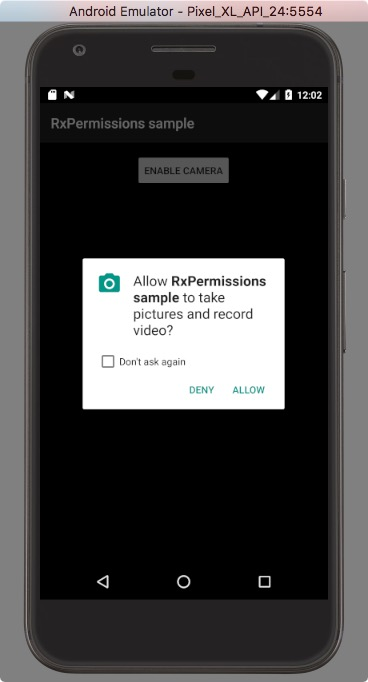

# 1 写在前面
话说 6.0 出来已经挺久了，对于权限适配我们也有很多轮子可用。关于如何适配 6.0 权限，网上资料很多也很完善，故并不会展开探讨。

不用第三方框架的话，我们会和这些 api 打交道：

- `Context.checkSelfPermission(String permission)`
- `Activity.requestPermissions(String[] permissions, int requestCode)`
- `Activity.onRequestPermissionsResult(int requestCode, String[] permissions, int[] grantResults)`
- `Activity.shouldShowRequestPermissionRationale(String permission)`

显然全部分析篇幅过长，根据二八法则，我们只分析主线而忽略掉庞杂的枝干。

本文假设你对 6.0 权限比较熟悉，试图与大家分享从 `requestPermissions` 到 `onRequestPermissionsResult` 的背后，究竟经历了什么。

# 2 场景跟踪
以下是 RxPermissions Demo 中，对相机权限的询问。



## 2.1 唤起对话框
我们看到 `requestPermissions` 触发了一个对话框。然而实际上，它是一个透明的 `Activity`，而且居然沿用了 `startActivityForResult` 的逻辑，怪不得也有个 `requestCode`。

```java
// Activity
public final void requestPermissions(@NonNull String[] permissions, int requestCode) {
    ...
    Intent intent = getPackageManager().buildRequestPermissionsIntent(permissions);
    startActivityForResult(REQUEST_PERMISSIONS_WHO_PREFIX, intent, requestCode, null);
    ...
}
```
我们从 `buildRequestPermissionsIntent` 往里跟，根据隐式 `Intent` 很快能找到对应的 `Activity` —— `GrantPermissionsActivity`。

```java
// PackageManager
public static final String ACTION_REQUEST_PERMISSIONS =
            "android.content.pm.action.REQUEST_PERMISSIONS";

public Intent buildRequestPermissionsIntent(@NonNull String[] permissions) {
    ...
    Intent intent = new Intent(ACTION_REQUEST_PERMISSIONS);
    intent.putExtra(EXTRA_REQUEST_PERMISSIONS_NAMES, permissions);
    intent.setPackage(getPermissionControllerPackageName());
    return intent;
}
```

## 2.2 点击事件
找到 `Activity` 再进一步去找弹框和点击事件。首先看 `onCreate()`:

```java
// GrantPermissionsActivity
private GrantPermissionsViewHandler mViewHandler;

@Override
public void onCreate(Bundle icicle) {
    super.onCreate(icicle);
    setFinishOnTouchOutside(false);

    setTitle(R.string.permission_request_title);

    if (DeviceUtils.isTelevision(this)) { // TV
        mViewHandler = new com.android.packageinstaller.permission.ui.television
                .GrantPermissionsViewHandlerImpl(this)
                .setResultListener(this);
    } else if (DeviceUtils.isWear(this)) { // 手环
        mViewHandler = new GrantPermissionsWatchViewHandler(this)
                .setResultListener(this);
    } else {	// 手持设备(手机)
        mViewHandler = new com.android.packageinstaller.permission.ui.handheld
                .GrantPermissionsViewHandlerImpl(this)
                .setResultListener(this);
    }
    
    ...
    
    setContentView(mViewHandler.createView());
}
```
一看，原来权限还支持手环和TV，只看我们关心的 `handheld` 。

```java
// handheld.GrantPermissionsViewHandlerImpl
@Override
public void onClick(View view) {
    switch (view.getId()) {
        case R.id.permission_allow_button:
            if (mResultListener != null) {
                view.clearAccessibilityFocus();
                mResultListener.onPermissionGrantResult(mGroupName, true, false);
            }
            break;
        case R.id.permission_deny_button:
            mAllowButton.setEnabled(true);
            if (mResultListener != null) {
                view.clearAccessibilityFocus();
                mResultListener.onPermissionGrantResult(mGroupName, false,
                        mDoNotAskCheckbox.isChecked());
            }
            break;
        case R.id.do_not_ask_checkbox:
            mAllowButton.setEnabled(!mDoNotAskCheckbox.isChecked());
            break;
    }
}
```
到这里，UI部分已经对应上了。有`不再询问`的选项框以及`允许`和`拒绝`两个按钮。只是点击的逻辑实现在外边。

## 2.3 回调onAcrivityResult()
我们又回到了 `GrantPermissionsActivity`，它实现了UI的回调，然后通过 `setResult()`，把授权结果返回给我们的app页面。

```java
// GrantPermissionsActivity implements GrantPermissionsViewHandler.ResultListener
@Override
public void onPermissionGrantResult(String name, boolean granted, boolean doNotAskAgain) {
    GroupState groupState = mRequestGrantPermissionGroups.get(name);
    if (groupState.mGroup != null) {
        if (granted) {
            groupState.mGroup.grantRuntimePermissions(doNotAskAgain);
            groupState.mState = GroupState.STATE_ALLOWED;
        } else {
            groupState.mGroup.revokeRuntimePermissions(doNotAskAgain);
            groupState.mState = GroupState.STATE_DENIED;
        }
        updateGrantResults(groupState.mGroup);
    }
    if (!showNextPermissionGroupGrantRequest()) {
        setResultAndFinish();
    }
}

private void setResultAndFinish() {
    setResultIfNeeded(RESULT_OK);
    finish();
}

private void setResultIfNeeded(int resultCode) {
    if (!mResultSet) {
        mResultSet = true;
        logRequestedPermissionGroups();
        Intent result = new Intent(PackageManager.ACTION_REQUEST_PERMISSIONS);
        result.putExtra(PackageManager.EXTRA_REQUEST_PERMISSIONS_NAMES, mRequestedPermissions);
        result.putExtra(PackageManager.EXTRA_REQUEST_PERMISSIONS_RESULTS, mGrantResults);
        setResult(resultCode, result);
    }
}
```

## 2.4 回调onRequestPermissionsResult()
回到 `Activity`，我们发现在 `dispatchActivityResult` 的同时，穿插了权限的分发。然后，很自然的就走到了我们的目的地。

```java
// Activity
void dispatchActivityResult(String who, int requestCode,
    int resultCode, Intent data) {
    ...
    if (who == null) {
        onActivityResult(requestCode, resultCode, data);
    } else if (who.startsWith(REQUEST_PERMISSIONS_WHO_PREFIX)) {
        who = who.substring(REQUEST_PERMISSIONS_WHO_PREFIX.length());
        if (TextUtils.isEmpty(who)) {
            dispatchRequestPermissionsResult(requestCode, data);
        } else ...    
    } else ...
}

private void dispatchRequestPermissionsResult(int requestCode, Intent data) {
    mHasCurrentPermissionsRequest = false;
    // If the package installer crashed we may have not data - best effort.
    String[] permissions = (data != null) ? data.getStringArrayExtra(
            PackageManager.EXTRA_REQUEST_PERMISSIONS_NAMES) : new String[0];
    final int[] grantResults = (data != null) ? data.getIntArrayExtra(
            PackageManager.EXTRA_REQUEST_PERMISSIONS_RESULTS) : new int[0];
    onRequestPermissionsResult(requestCode, permissions, grantResults);	// 终点在此
}
```

## 2.5 权限的允许/拒绝
前面的逻辑基本上是UI层的，大题算是走通了。而细心的你可能发现 2.3 中遗漏了`权限的允许/拒绝`未讲。这部分涉及 `Binder` 和 `aidl` 调用，不了解的童鞋可以先去补一下。

以权限允许为例，粗略的过一下调用栈：

- GrantPermissionsActivity.onPermissionGrantResult()
- AppPermissionGroup.grantRuntimePermissions()
- PackageManager.grantRuntimePermission()
- IPackageManager.grantRuntimePermission()
- PackageManagerService.grantRuntimePermission()

最后调用到的是系统层的 PMS，大致上是根据`应用包名`和`权限名`更改 `sb.PermissionsState` 里的权限列表，最后异步保存进文件里。
PS: 这里的 `sb` 是 `SettingBase`，实例是 `PackageSetting`。顾名思义，它保存着应用(package)级别的设置。

结合代码和断点风味更佳：

```java
// PackageManagerService
@Override
public void grantRuntimePermission(String packageName, String name, final int userId) {
    ...

    final int uid;
    final SettingBase sb;

    synchronized (mPackages) {
        final PackageParser.Package pkg = mPackages.get(packageName);
        final BasePermission bp = mSettings.mPermissions.get(name);
        ...

        uid = UserHandle.getUid(userId, pkg.applicationInfo.uid);
        sb = (SettingBase) pkg.mExtras;
        final PermissionsState permissionsState = sb.getPermissionsState();

        ...

        // 授予权限，即更改 sb.PermissionsState 里的权限列表状态
        final int result = permissionsState.grantRuntimePermission(bp, userId);
        switch (result) {
            case PermissionsState.PERMISSION_OPERATION_FAILURE: {
                return;
            }

            case PermissionsState.PERMISSION_OPERATION_SUCCESS_GIDS_CHANGED: {
                ...
            }
            break;
        }

        // 提供一个回调 PackageManager.OnPermissionsChangedListener, 然而它对应用层是hide的
        mOnPermissionChangeListeners.onPermissionsChanged(uid);

        // 保存权限的更改，写入文件里
        mSettings.writeRuntimePermissionsForUserLPr(userId, false);
    }

    if (READ_EXTERNAL_STORAGE.equals(name)
            || WRITE_EXTERNAL_STORAGE.equals(name)) {
        ...
    }
}
```


# 3 总结
6.0 权限的主线大概过了一遍，如有纰漏请留言指正，欢迎留言探讨。

>另，看源码时切勿陷入一些琐碎的细节，比如最后的写入文件，大体上就一个 `FileOutputStream`，有兴趣可以看看。

>吾生也有涯，而知也无涯，以有涯随无涯，殆已~

# 4 感谢
[Android源码环境搭建 - Gityuan](http://gityuan.com/2016/08/13/android-os-env/)

[如何调试Android Framework - Weishu](http://weishu.me/2016/05/30/how-to-debug-android-framework/)


